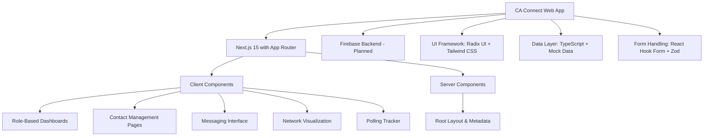

# CA Connect Technical Documentation v1

## Overview

CA Connect is a web application designed for political campaign management in California. It provides a secure, invite-only network platform where candidates can assign primary campaigners to build and manage their voter networks. The application focuses on contact verification, relationship tagging, support likelihood rating, template messaging, and real-time polling day tracking.

## Architecture

The application follows a modern Next.js architecture using the App Router for file-based routing and server components. It employs a client-server hybrid approach with React components handling the UI and mock data serving as the current data layer.



## Technology Stack

### Core Framework
- **Next.js 15.3.3**: React framework with App Router, server components, and optimized performance
- **TypeScript 5**: Type-safe JavaScript for better developer experience and code reliability
- **React 18.3.1**: UI library with concurrent features

### Styling & UI
- **Tailwind CSS 3.4.1**: Utility-first CSS framework for responsive design
- **Radix UI**: Unstyled, accessible UI primitives (Accordion, Dialog, Dropdown, etc.)
- **Lucide React 0.475.0**: Modern icon library
- **PT Sans Font**: Clean, professional typography as per design guidelines

### Data & Forms
- **React Hook Form 7.54.2**: Performant forms with easy validation
- **Zod 3.24.2**: TypeScript-first schema validation
- **Firebase 11.9.1**: Backend-as-a-Service for authentication, database, and real-time features

### Visualization & Utilities
- **Recharts 2.15.1**: Composable charting library for data visualization
- **Date-fns 3.6.0**: Modern JavaScript date utility library
- **Class Variance Authority 0.7.1**: Component variant management
- **clsx & tailwind-merge**: Conditional className utilities

### Development Tools
- **ESLint**: Code linting
- **TypeScript Compiler**: Type checking
- **PostCSS 8**: CSS processing
- **Patch Package 8.0.0**: Package patching for dependencies

## Data Models

### Core Types

```typescript
type Relationship = 'Family' | 'Friend' | 'Colleague' | 'Neighbor' | 'Acquaintance' | 'Other';
type SupportLikelihood = 'High' | 'Medium' | 'Low' | 'Unsure';
type AppStatus = 'Installed' | 'Pending' | 'Not Joined';
type PollingStatus = 'Voted' | 'Not Voted Yet' | 'Unknown';

interface Contact {
  id: string;
  name: string;
  memberId: string; // CA Member ID for verification
  relationship: Relationship;
  support: SupportLikelihood;
  canInfluence: boolean;
  appStatus: AppStatus;
  networkSize: number;
  pollingStatus: PollingStatus;
  lastSeen?: string;
}

interface MessageTemplate {
  id: string;
  title: string;
  from: string;
  received: string;
  content: string;
  type: 'Urgent' | 'Scheduled';
}

interface User {
  name: string;
  level?: number;
}
```

### Data Structure

The application uses a hierarchical network structure:
- **Primary Contacts**: Direct connections managed by campaigners
- **Secondary Networks**: Contacts of primary contacts, forming a tiered structure
- **Message Templates**: Pre-approved content for consistent communication

Mock data provides realistic examples with 8 primary contacts and their associated networks.

## Key Components

### Layout Components
- **AppLayout**: Responsive layout with role-based navigation sidebar
- **RootLayout**: HTML structure with metadata and font loading

### UI Component Library
Complete set of accessible UI components based on Radix UI:
- Form controls (Input, Select, Checkbox, etc.)
- Feedback components (Toast, Alert, Dialog)
- Data display (Table, Card, Badge)
- Navigation (Sheet for mobile menu)
- Charts and visualizations

### Utility Components
- **CampaignLogo**: SVG logo component
- **Icons**: Centralized icon management

## Pages and Features

### Authentication & Onboarding
- **Role Selection Page** (`/`): Landing page for choosing between Candidate and Campaigner roles
- URL-based role management with search parameters

### Dashboard (Role-Specific)

#### Campaigner Dashboard
- Personal network overview
- Recent contacts display
- Latest message template
- Polling day alerts
- Direct navigation to add contacts and send messages

#### Candidate Dashboard
- Network-wide analytics and metrics
- Support score calculation (weighted by likelihood)
- Trend charts for support score over time
- Support likelihood breakdown (bar chart)
- Recent direct contacts
- Total network reach statistics
- Active member counts

### Contact Management
- **Contacts List** (`/contacts`): Paginated contact display with filtering
- **Add Contact** (`/contacts/add`): Form for adding verified contacts with relationship tagging
- Support level rating system
- Contact verification via CA Member ID

### Messaging System
- **Messages Page** (`/messages`): Template library with send functionality
- Urgent vs Scheduled message types
- Centralized message management for campaign consistency

### Network Visualization
- **Network Tree** (`/network/tree`): Hierarchical network display (Candidate only)
- Visual representation of primary and secondary connections
- Network size and influence indicators

### Polling Day Tracker
- **Polling Page** (`/polling`): Real-time voting status monitoring
- Contact status updates (Voted/Not Voted/Unknown)
- Mobilization tools and reminders

### Settings
- **Settings Page** (`/settings`): User preferences and configuration

## Role-Based Access Control

### Campaigner Role
- Manage personal network of verified contacts
- Add contacts with mandatory relationship tagging
- Rate support likelihood for prioritization
- Send pre-approved message templates
- Monitor polling status of network members
- Receive urgent campaign communications

### Candidate Role
- View comprehensive network analytics across all levels
- Access to network tree visualization
- Monitor support score trends and breakdowns
- Manage direct contacts
- Receive detailed performance metrics

## Core Features Implementation

### Contact Verification System
- Mandatory CA Member ID for contact addition
- Prevents duplicate entries and ensures authenticity

### Relationship Tagging
- Predefined relationship types for better contact segmentation
- Influences prioritization and communication strategies

### Support Likelihood Rating
- 4-level scale: High (4 points), Medium (3 points), Low (1 point), Unsure (0 points)
- Weighted scoring system for network strength calculation

### Template Messaging
- Centralized message library maintained by campaign leadership
- Ensures consistent messaging and compliance
- Marked as Urgent or Scheduled based on priority

### Polling Day Tracking
- Real-time status updates for voting participation
- Targeted mobilization for non-voters
- Integration with contact influence ratings

### Network Analytics (Candidate View)
- Multi-level network reach calculation
- Active member tracking
- Support score trending with historical data
- Relationship distribution analysis

## Development Workflow

### Scripts
- `npm run dev`: Development server with Turbopack
- `npm run build`: Production build
- `npm run start`: Production server
- `npm run lint`: ESLint checking
- `npm run typecheck`: TypeScript compilation check

### Project Structure
```
src/
├── app/                 # Next.js App Router pages
│   ├── (role-based pages)/
│   └── layout.tsx
├── components/          # Reusable UI components
│   ├── ui/             # Radix-based primitives
│   └── layout/         # Layout components
├── hooks/              # Custom React hooks
├── lib/                # Utilities and data
│   ├── data.ts         # Mock data
│   ├── types.ts        # TypeScript definitions
│   └── utils.ts        # Helper functions
```

## Future Enhancements

### Planned Features
- Firebase authentication and real-time database integration
- AI-powered engagement suggestions based on contact profiles
- Push notifications for urgent updates
- Advanced analytics and reporting
- Mobile application development
- Multi-language support

### Technical Improvements
- API route implementation for server actions
- Database schema design
- Real-time data synchronization
- Performance optimization for large networks
- Accessibility enhancements

## Design System

Following the blueprint specifications:
- **Primary Color**: Deep blue (#3F51B5) for trust and authority
- **Background**: Light gray (#F0F2F5) for clean interface
- **Accent**: Vibrant orange (#FF9800) for CTAs
- **Typography**: PT Sans for modern, approachable feel
- **Icons**: Intuitive Lucide icons for actions and statuses
- **Layout**: Clear visual hierarchy with subtle animations

## Security Considerations

- Contact verification through member IDs
- Role-based access control
- Secure data handling with TypeScript
- Firebase security rules (planned)
- Input validation with Zod schemas

This documentation provides a comprehensive overview of the CA Connect application's current implementation and planned architecture.